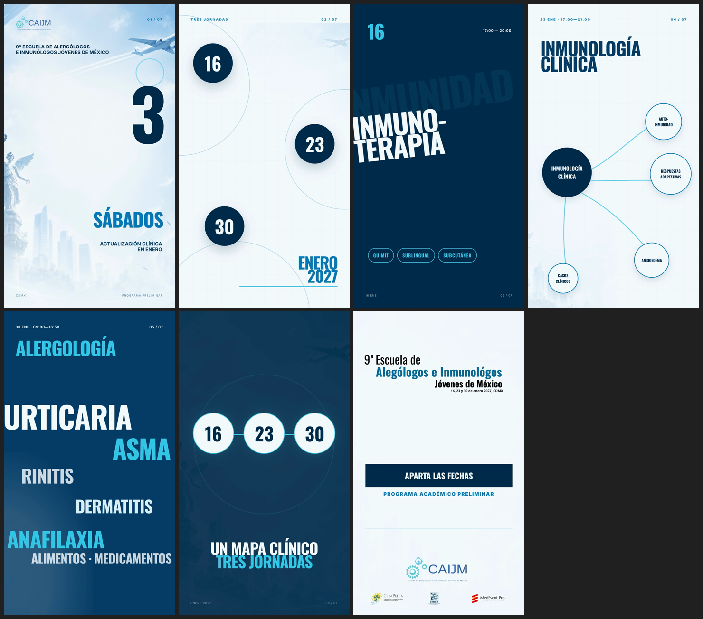

# Programa CAIJM 2027 — video

Proyecto editable del video vertical para la **9ª Escuela de Alergólogos e Inmunólogos Jóvenes de México**, programada para los días 16, 23 y 30 de enero de 2027 en CDMX.

La pieza fue construida en HyperFrames con HTML, CSS y GSAP. Utiliza la identidad gráfica suministrada para el evento, tipografía Oswald para titulares e Inter para información secundaria.



## Entregable

- Video final: [`renders/final.mp4`](renders/final.mp4)
- Formato: 1080 × 1920, 30 fps
- Duración: 40 segundos
- Video: H.264
- Audio: AAC estéreo

## Estructura

```text
hyperframes/       Composición editable y recursos utilizados
artifacts/         Guion, plan de escenas y decisiones de producción
snapshots/         Frame representativo de cada escena
renders/           Video final y lámina de revisión
art-direction.md   Dirección visual del proyecto
```

## Requisitos

- Node.js 22 o posterior
- FFmpeg
- npm / npx

No es necesario instalar HyperFrames globalmente: los scripts fijan la versión `0.8.112` mediante `npx`.

## Previsualizar

```bash
cd hyperframes
npm run dev
```

## Validar

```bash
cd hyperframes
npm run check
```

## Renderizar

```bash
cd hyperframes
npm run render -- --quality high --output ../renders/final.mp4
```

## Edición

La composición principal está en [`hyperframes/index.html`](hyperframes/index.html). Ahí se encuentran:

- Las siete escenas y sus tiempos.
- El sistema tipográfico Oswald + Inter.
- Las animaciones GSAP.
- La jerarquía institucional del cierre.
- Los recortes del Ángel de la Independencia y el avión.

Los recursos de marca están en `hyperframes/assets/brand/` y la música en `hyperframes/assets/music/`.

## Derechos y recursos

Este repositorio se publica para revisión y colaboración del proyecto. Los nombres, logotipos y recursos de CAIJM, ComPEDIA, CMICA y Medevent Pro pertenecen a sus respectivos titulares; su presencia aquí no concede una licencia general de reutilización.

La pista musical incluida fue obtenida de Pixabay Music bajo la Pixabay Content License. Consulta `artifacts/asset_manifest.json` para conocer su procedencia y metadatos.

